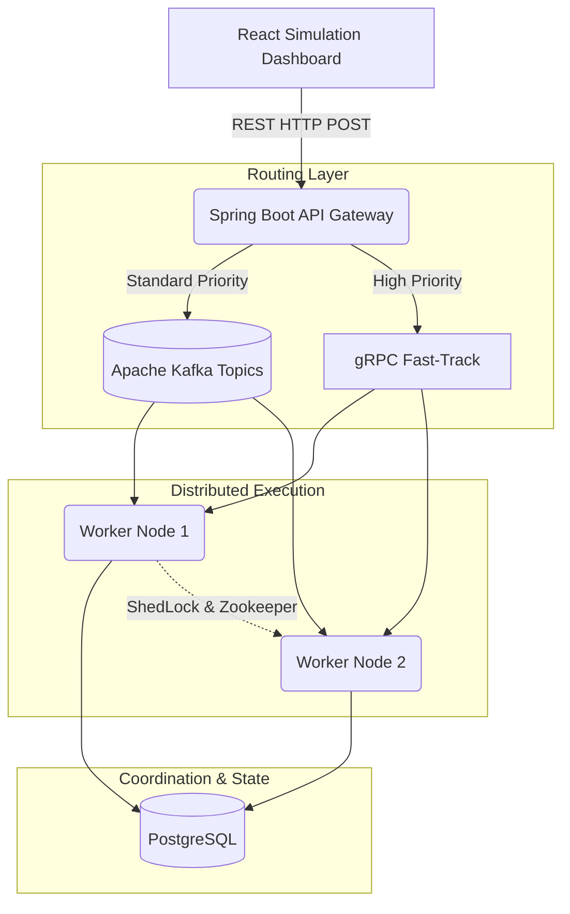

<div align="center">
  <h1>🚀 Torrent Distributed Engine</h1>
  <p><strong>A Highly Scalable, Event-Driven Job Execution Engine for Massive Workloads</strong></p>
  
  <p>
    
    
    
    
    
  </p>
</div>

## 📖 Overview
**Torrent** is an enterprise-grade, distributed job execution engine designed to handle hundreds of thousands of asynchronous tasks with absolute fault tolerance. Built entirely on a **Microservices Architecture**, Torrent uses event-streaming and remote procedure calls to rapidly distribute background tasks across a cluster of resilient worker nodes.

This project comes equipped with a **real-time React Developer Console** and **Simulation Dashboard**, allowing you to visualize jobs flowing through the system's infrastructure dynamically, manage your cluster, and debug worker nodes in real-time.

---

## 🏗️ System Architecture

Our architecture guarantees zero single points of failure. The system routes background tasks through two distinct pipelines based on priority:

1. **Standard & Low Priority:** Pushed into **Apache Kafka** event topics for guaranteed sequential delivery and high-throughput batching.
2. **High Priority (Fast-Track):** Bypasses Kafka entirely, using **gRPC Streams** for direct, low-latency execution by the worker nodes.



---

## ⚡ Key Features
* **Dynamic Fleet Tracking:** Every worker node generates a unique cryptographic heartbeat signature (e.g., `worker:6f3a...`). The central database inherently tracks exactly *which* physical server executed *which* job for unmatched observability.
* **Resilient Retry Policy:** Configurable exponential backoff modifiers (`maxAttempts`, `backoffMultiplier`) for flaky tasks.
* **Idempotency Guarantees:** Strict checking on `idempotencyKey` ensures that network partitions do not result in duplicate job executions.
* **Distributed Cron Scheduling:** Capable of scheduling millions of recurring jobs without collision using Zookeeper-backed ShedLock.
* **Secure API Keys:** Full decoupling of master API keys managed securely via an external `.env` injection system.

---

## 🚀 Local Installation & Usage Guide

### Prerequisites
- **Docker Desktop** (Make sure the Docker daemon is actively running!)
- **Node.js (v18+) & NPM**

### 1. Install the Torrent CLI
Torrent ships with a powerful Global CLI for managing your local cluster development experience.
```bash
cd torrent-cli
npm install -g .
```

### 2. Configure Your Cluster Security
Before starting the cluster, you must set a Master API Key. This key is securely saved to `~/.torrent/.env` and automatically injected into the backend upon boot.
```bash
torrent key my_super_secret_key
```

### 3. Start the Engine!
The CLI handles the orchestration of the entire infrastructure (Zookeeper, Kafka, Redis, PostgreSQL) alongside the Spring Boot microservices and React Dashboards.
```bash
torrent start
```
*Wait a minute for the Spring Boot JVMs to compile and boot up inside the Docker containers.*

### 4. Access the Dashboards
Once the system is up and running, open your browser:
- **Developer Console:** [http://localhost:8081](http://localhost:8081) *(Login using the API key you set in Step 2!)*
- **Demo UI (Simulation):** [http://localhost:5173](http://localhost:5173)

### 5. Check Status or Shutdown
```bash
torrent ps     # View the health of all running Torrent containers
torrent stop   # Gracefully shut down the entire cluster
```

---

## ☁️ Cloud Deployment Guide

Ready to take Torrent to production? The entire system is built natively for container orchestrators like Kubernetes or cloud-native platform-as-a-service (PaaS) providers.

### Deploying to Render / AWS ECS / DigitalOcean Apps
1. **Managed Infrastructure:** Spin up managed versions of PostgreSQL, Redis, and Apache Kafka (e.g., Confluent Cloud or Amazon MSK).
2. **Environment Variables:** Set the following environment variables in your cloud provider's dashboard:
   - `SPRING_DATASOURCE_URL`, `SPRING_DATASOURCE_USERNAME`, `SPRING_DATASOURCE_PASSWORD`
   - `SPRING_KAFKA_BOOTSTRAP_SERVERS`
   - `SPRING_REDIS_HOST`, `SPRING_REDIS_PORT`
   - `TORRENT_API_KEY` (Your master security key!)
3. **Backend Deployment:** Deploy the `torrent-backend` Dockerfile as a Web Service.
4. **Console/UI Deployment:** Deploy the `torrent-console` and `torrent-ui` React applications as Static Sites, pointing `VITE_API_URL_BASE` to your backend's public URL.

*(Note: For the absolute highest performance, ensure your API Gateway and Worker Nodes are deployed in the same VPC/Region to minimize gRPC latency!)*

---

<div align="center">
  <p>Built with ❤️ by <strong>Debi Prasad Das</strong></p>
  <a href="https://github.com/developer4949-code/Torrent">GitHub</a> • 
  <a href="https://www.linkedin.com/in/debi-prasad-das-458878292/">LinkedIn</a>
</div>
