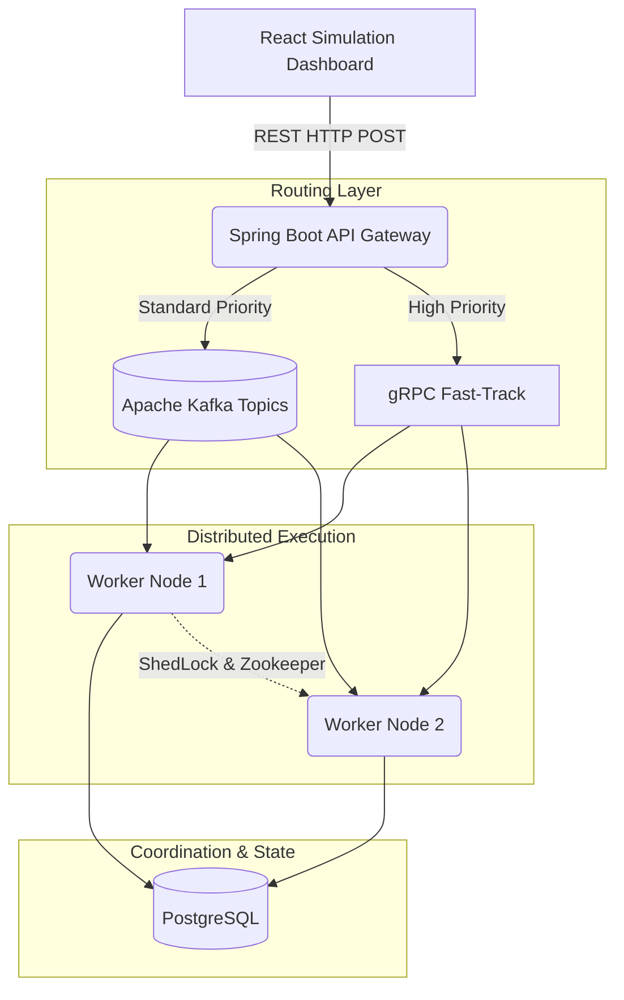

<div align="center">
  <h1>🚀 Torrent Distributed Engine</h1>
  <p><strong>A Highly Scalable, Event-Driven Job Execution Engine for Massive Workloads</strong></p>
  
  <p>
    
    
    
    
    
  </p>
</div>

## 📖 Overview
**Torrent** is an enterprise-grade, distributed job execution engine designed to handle hundreds of thousands of asynchronous tasks with absolute fault tolerance. Built entirely on a **Microservices Architecture**, Torrent uses event-streaming and remote procedure calls to rapidly distribute background tasks across a cluster of resilient worker nodes.

This project comes equipped with a **real-time React simulation dashboard**, allowing you to visualize jobs flowing through the system's infrastructure dynamically.

---

## 🏗️ System Architecture

Our architecture guarantees zero single points of failure. The system routes background tasks through two distinct pipelines based on priority:

1. **Standard & Low Priority:** Pushed into **Apache Kafka** event topics for guaranteed sequential delivery and high-throughput batching.
2. **High Priority (Fast-Track):** Bypasses Kafka entirely, using **gRPC Streams** for direct, low-latency execution by the worker nodes.



---

## 💻 Tech Stack & Design Choices

| Technology | Role | Justification |
| :--- | :--- | :--- |
| **Java 21 & Spring Boot** | Core Framework | Industry standard for enterprise microservices. Provides rapid dependency injection and robust security features out of the box. |
| **Apache Kafka** | Event Streaming | Unmatched throughput. Guarantees message persistence and decoupled producer-consumer architecture, meaning workers can scale horizontally without affecting the API gateway. |
| **gRPC & Protocol Buffers** | High-Priority Fast-Track | Significantly faster than REST over HTTP/2. By bypassing the Kafka queue for `HIGH` priority jobs, we achieve near-instantaneous execution. |
| **ShedLock + Zookeeper** | Distributed Cron Locking | When scaling out to multiple identical API nodes, ShedLock uses a centralized lock to ensure cron schedules fire exactly once across the cluster. |
| **PostgreSQL** | Relational Persistence | Ensures ACID compliance when updating complex job execution states (`PENDING`, `SCHEDULED`, `COMPLETED`, `FAILED`). |
| **React + Vite** | Simulation Dashboard | A high-performance frontend for visualizing system health, built with a glassmorphism design system to impress stakeholders. |

---

## ⚙️ Core Features
* **Resilient Retry Policy:** Configurable exponential backoff modifiers (`maxAttempts`, `backoffMultiplier`) for flaky tasks.
* **Idempotency Guarantees:** Strict checking on `idempotencyKey` ensures that network partitions do not result in duplicate job executions.
* **Distributed Cron Scheduling:** Capable of scheduling millions of recurring jobs without collision using Zookeeper-backed ShedLock.
* **Observability:** Centralized logging architecture across all Spring Boot nodes.

---

## 🚀 Getting Started

### 1. Prerequisites
- Docker & Docker Compose
- Java 21 (JDK)
- Node.js (v18+) & NPM

### 2. Bootstrapping the Infrastructure
Start the backing infrastructure (PostgreSQL, Redis, Kafka, Zookeeper) using Docker:
```bash
docker-compose -f infra/docker-compose.yml up -d
```

### 3. Launch the Microservices
To compile and launch the Spring Boot cluster (API Gateway, Scheduler, Worker), simply execute the PowerShell runner script from the root directory:
```powershell
.\run-torrent.ps1
```
*This will perform a clean Maven build and boot up the JVM instances.*

### 4. Launch the Simulation Dashboard
In a new terminal window, navigate to the UI directory and start Vite:
```bash
cd torrent-ui
npm install
npm run dev
```

Open your browser to [http://localhost:5173](http://localhost:5173) and begin queuing jobs!

---

<div align="center">
  <p>Built with ❤️ by <strong>Debi Prasad Das</strong></p>
  <a href="https://github.com/developer4949-code/Torrent">GitHub</a> • 
  <a href="https://www.linkedin.com/in/debi-prasad-das-458878292/">LinkedIn</a>
</div>
